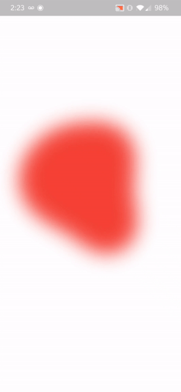

# metaballs

An animation built in Flutter using CustomPaint and the Canvas to create an amorphous blob like object called a [metaball](https://en.wikipedia.org/wiki/Metaballs). Makes use of the [marching squares algorithm](https://en.wikipedia.org/wiki/Marching_squares) and linear interpolation to optimize rendering performance.

## Example

## How to Run

1. Clone this repo
2. Follow the Flutter installation steps found [here](https://flutter.dev/docs/get-started/install).
3. Run the command `flutter run --release`
